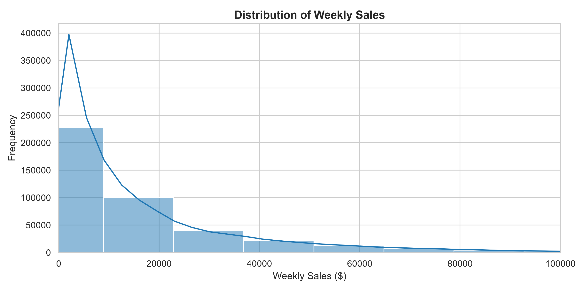
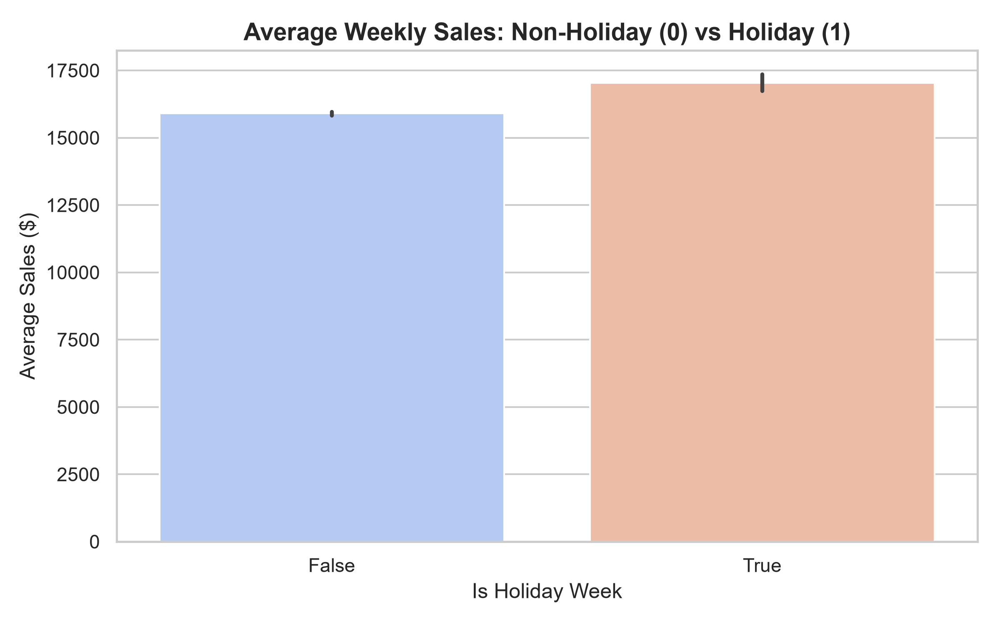
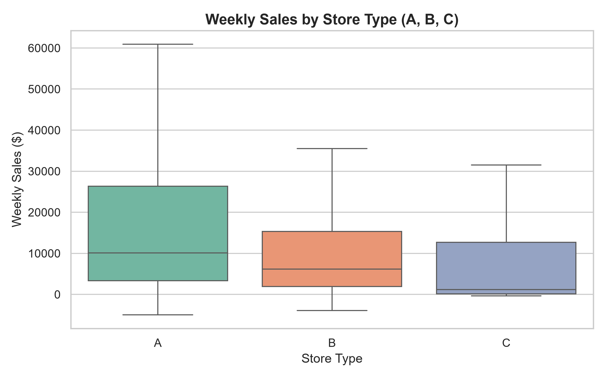
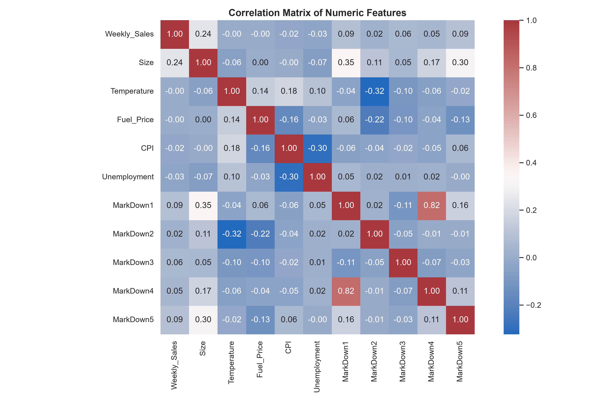
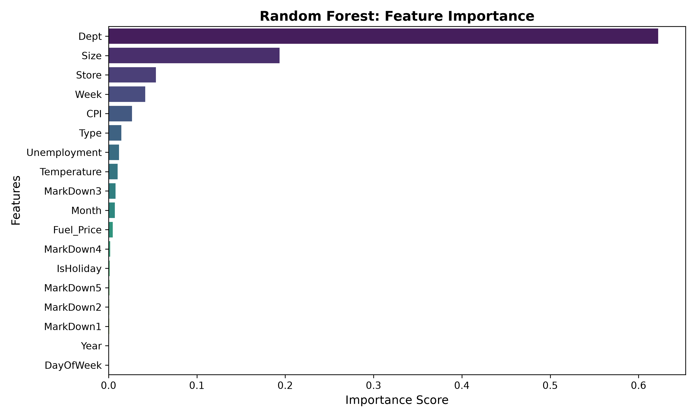
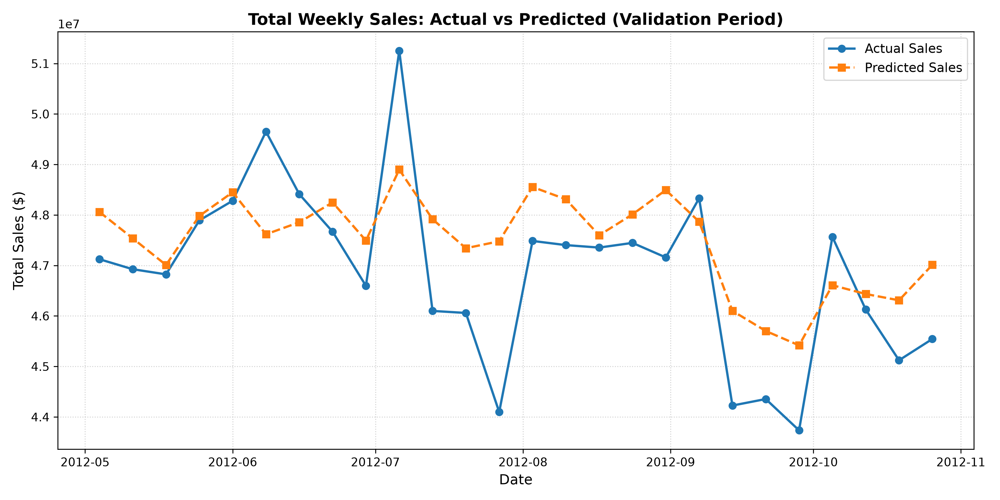

# 🛒 Walmart Store Sales Forecasting & Analytics System

An end-to-end Machine Learning system and interactive analytics web application designed to forecast weekly departmental sales across 45 Walmart stores using historical retail data, promotional markdowns, and macroeconomic indicators.

---

## 📌 Project Highlights

- **Target Metric**: Kaggle Official WMAE (Weighted Mean Absolute Error with 5x holiday weights)
- **Model Engine**: Random Forest Regressor
- **Web App**: Streamlit Dashboard with SQLite User Authentication & What-If Simulation
- **Key Results**:
  - **R² Score**: `0.9733`
  - **WMAE**: `1779.28`
  - **MAE**: `1753.04`
  - **RMSE**: `3596.99`

---

## 📊 Exploratory Data Analysis & Visualizations

|                     Sales Distribution                      |                     Holiday Impact                      |
| :---------------------------------------------------------: | :-----------------------------------------------------: |
|  |  |

|             Store Types & Size Dynamics              |                     Correlation Matrix                      |
| :--------------------------------------------------: | :---------------------------------------------------------: |
|  |  |

|                   Feature Importance                    |               Actual vs Predicted Forecast               |
| :-----------------------------------------------------: | :------------------------------------------------------: |
|  |  |

---

## 🔍 Key Data Insights

1. **Sales Skewness**: Weekly sales show strong right-skewness; log-transformation effectively normalizes data for linear modeling comparisons.
2. **Holiday Spikes**: Thanksgiving, Christmas, and Super Bowl weeks drive significantly higher average sales compared to regular operational periods.
3. **Store Segmentation**: Type A stores dominate volume due to larger physical square footage, followed by Type B and Type C.
4. **Driver Importance**: Department ID and Store Size account for the vast majority of predictive power in the Random Forest model.

---

## 🛠️ Architecture & Pipeline

1. `src/data_preprocessing.py`: Joins raw store metadata, economic features, and historical train records.
2. `src/feature_engineering.py`: Temporal calendar features extraction, markdown imputation, and ordinal encoding.
3. `src/train_model.py`: Time-based split validation (zero lookahead leakage) and Random Forest serialization.
4. `src/eda_analysis.py`: Runs automated statistical checks and exports all 5 core visual plots to `reports/`.
5. `src/evaluate_visualize.py`: Evaluates holdout validation set and tracks actual vs predicted trends.
6. `app.py`: Dual-tab Streamlit dashboard with SQLite-backed auth (Login/Signup), KPI metrics, interactive Plotly charts, and What-If scenario predictor.

---

## 🚀 How to Run Locally

```bash
# 1. Clone the repository
git clone [https://github.com/NishantKumar947/CODTECH-Task2-Store-Sales-Forecasting.git](https://github.com/NishantKumar947/CODTECH-Task2-Store-Sales-Forecasting.git)
cd CODTECH-Task2-Store-Sales-Forecasting

# 2. Activate virtual environment
venv\Scripts\activate

# 3. Install dependencies
pip install -r requirements.txt

# 4. Launch Dashboard
streamlit run app.py
```
